# AI Code Agent 비교 분석 리포트

**분석 대상**
- VSCode Copilot Chat (Microsoft) - VSCode Extension
- Gemini CLI (Google) - Command-Line Interface

**분석 일자**: 2025-12-05

---

## 목차

1. [코드베이스 분석 및 답변 생성 방식](#1-코드베이스-분석-및-답변-생성-방식)
2. [Agentic Workflow 아키텍처](#2-agentic-workflow-아키텍처)
3. [사용자 Query 처리 흐름](#3-사용자-query-처리-흐름)
4. [종합 비교 및 장단점](#4-종합-비교-및-장단점)

---

## 1. 코드베이스 분석 및 답변 생성 방식

### 1.1 VSCode Copilot Chat

#### 검색 전략 (Multi-Strategy Search)

VSCode Copilot은 **하이브리드 검색 시스템**을 사용합니다:

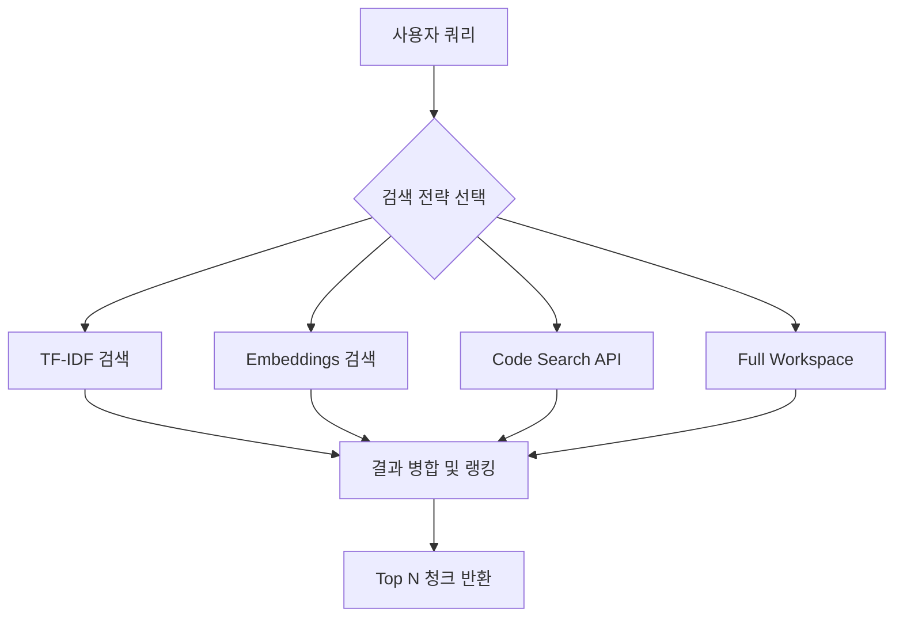

**핵심 컴포넌트:**

| 컴포넌트 | 파일 경로 | 역할 |
|---------|---------|------|
| Codebase Tool | `src/extension/tools/node/codebaseTool.tsx` | 코드베이스 검색 도구 |
| Workspace Chunk Search | `src/platform/workspaceChunkSearch/node/workspaceChunkSearchService.ts` | 워크스페이스 검색 서비스 |
| TF-IDF Search | `tfidfChunkSearch.ts` | 키워드 기반 검색 |
| Embeddings Search | `embeddingsChunkSearch.ts` | 시맨틱 벡터 검색 |
| Hybrid Search | `tfidfWithSemanticChunkSearch.ts` | TF-IDF + Embeddings 결합 |

**인덱싱 메커니즘:**

1. **로컬 인덱스**
   - Workspace File Index: 파일 메타데이터 관리
   - Chunk Cache: 파일 청크 + 임베딩 캐싱
   - Embeddings Index: 벡터 유사도 검색

2. **원격 인덱스**
   - GitHub Code Search API 통합
   - 저장소 인덱싱 상태 추적
   - Fallback to 로컬 검색

**청크 관리:**
- 파일을 512-1024 토큰 크기의 청크로 분할
- 각 청크에 포함: content, file path, line numbers, language
- 관련성 점수 기반 랭킹 및 중복 제거
- 기본 최대 32개 결과 반환

---

### 1.2 Gemini CLI

#### 3-Tier 컨텍스트 디스커버리 시스템

Gemini CLI는 **계층적 메모리 시스템**을 사용합니다:

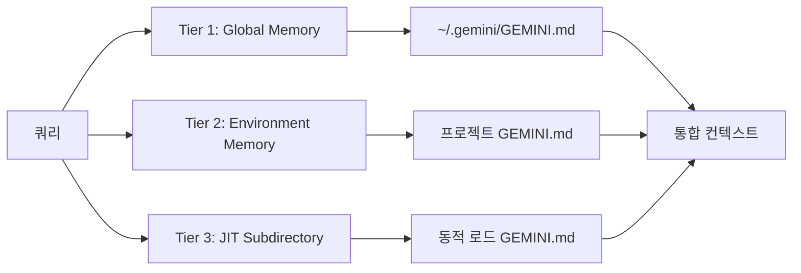

**핵심 컴포넌트:**

| 컴포넌트 | 파일 경로 | 역할 |
|---------|---------|------|
| Memory Discovery | `packages/core/src/utils/memoryDiscovery.ts` | GEMINI.md 파일 발견 |
| Context Manager | `packages/core/src/services/contextManager.ts` | 3-tier 컨텍스트 관리 |
| File Discovery | `packages/core/src/services/fileDiscoveryService.ts` | .gitignore/.geminiignore 필터링 |
| Environment Context | `packages/core/src/utils/environmentContext.ts` | 환경 컨텍스트 생성 |

**도구 기반 코드 검색:**

1. **Grep Tool** (`grep.ts`)
   - Ripgrep 기반 고속 정규식 검색
   - Gitignore/Geminiignore 필터링

2. **Glob Tool** (`glob.ts`)
   - 패턴 기반 파일 발견 (`**/*.ts`)

3. **Read File/Read Many Files**
   - 라인 범위 지정 읽기
   - 배치 파일 읽기로 효율성 증대

4. **LS Tool** (`ls.ts`)
   - 디렉토리 구조 탐색

---

### 1.3 비교 분석

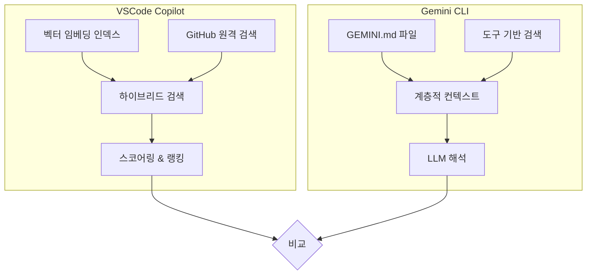

| 측면 | VSCode Copilot | Gemini CLI |
|-----|---------------|-----------|
| **인덱싱 방식** | 자동 임베딩 인덱스 생성 | 명시적 GEMINI.md 파일 |
| **검색 속도** | 빠름 (사전 인덱싱) | 중간 (JIT 검색) |
| **정확도** | 시맨틱 유사도 기반 | LLM 도구 호출 기반 |
| **설정 난이도** | 낮음 (자동) | 중간 (GEMINI.md 작성) |
| **메모리 사용** | 높음 (인덱스 캐싱) | 낮음 (온디맨드) |

**장점 비교:**

**VSCode Copilot 장점:**
- 자동 인덱싱으로 설정 불필요
- 빠른 시맨틱 검색
- 대규모 코드베이스에 효율적

**Gemini CLI 장점:**
- 사용자가 컨텍스트 제어 가능
- 메모리 효율적
- 명시적 도메인 지식 주입 가능 (GEMINI.md)

---

## 2. Agentic Workflow 아키텍처

### 2.1 VSCode Copilot Chat

#### Agent 시스템 설계

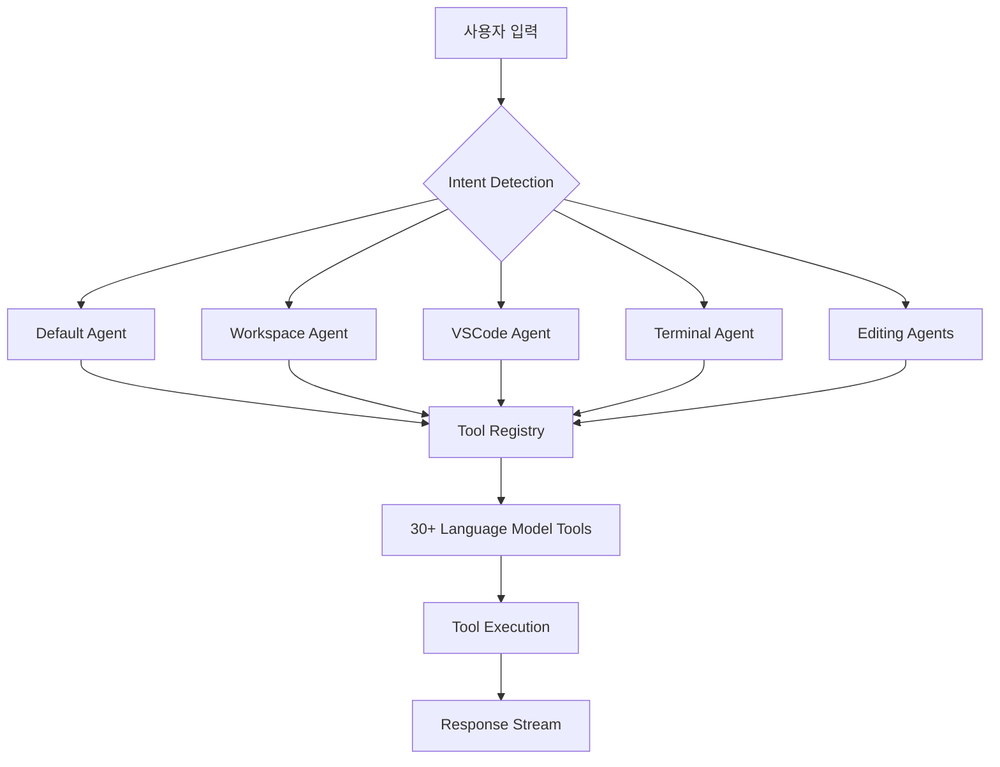

**Agent 타입 (8개):**

1. **Default Agent** (`github.copilot.default`) - 일반 프로그래밍 질문
2. **Workspace Agent** (`workspace`) - 워크스페이스 쿼리
3. **VSCode Agent** (`vscode`) - VSCode 헬프
4. **Terminal Agent** (`terminal`) - 터미널 명령 지원
5. **Editing Agents** (`editingSession`, `editsAgent`) - 코드 편집
6. **Notebook Agent** (`notebook`) - Jupyter 노트북
7. **Background Agent** (`copilotcli`) - 장기 실행 작업
8. **Cloud Agent** (`copilot-cloud-agent`) - 클라우드 기반 실행

**도구 시스템 (30+ 도구):**

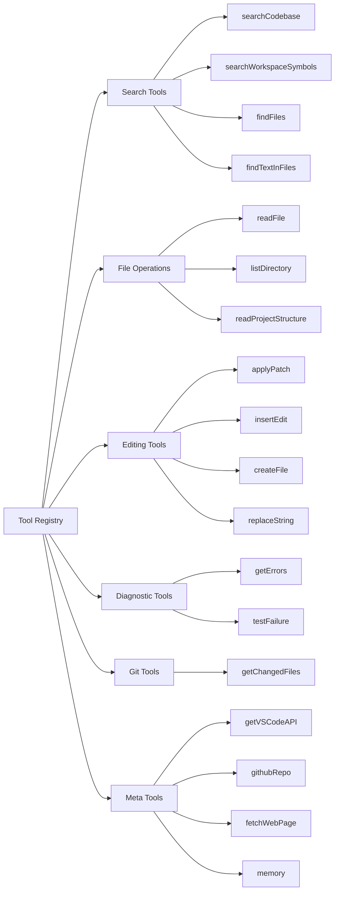

**도구 호출 루프:**

```typescript
// 의사 코드
while (!completed && turns < maxTurns) {
  1. Send request with tools
  2. Model responds with tool calls
  3. Execute tools in parallel
  4. Inject results back
  5. Model continues with results
  // 최대 5번 반복
}
```

**의사결정 프로세스:**

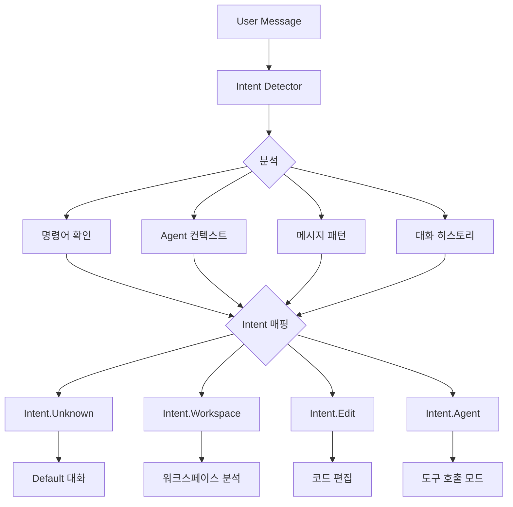

---

### 2.2 Gemini CLI

#### Agent Executor 아키텍처

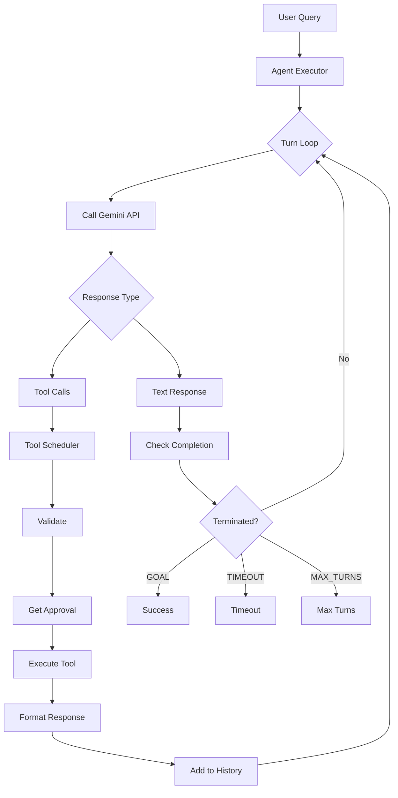

**Agent Executor 특징:**

| 특징 | 설명 |
|-----|------|
| **Turn-based 실행** | 각 턴마다 모델 호출 및 도구 처리 |
| **종료 모드** | GOAL, TIMEOUT, MAX_TURNS, ABORTED, ERROR |
| **복구 메커니즘** | 60초 grace period |
| **채팅 압축** | 컨텍스트 한계 근접 시 자동 압축 |

**Codebase Investigator Agent (특수화된 하위 Agent):**

```typescript
{
  name: 'codebase_investigator',
  tools: [LS, READ_FILE, GLOB, GREP], // 읽기 전용
  maxTime: 5분,
  maxTurns: 15,
  temperature: 0.1, // 결정론적 분석

  output: {
    SummaryOfFindings: string,
    ExplorationTrace: string[],
    RelevantLocations: Array<{FilePath, Reasoning, KeySymbols}>
  }
}
```

**Scratchpad 방법론:**

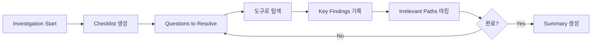

**도구 정의 패턴:**

```typescript
class BaseDeclarativeTool {
  - name: string
  - description: string  // 시스템 프롬프트에 사용
  - parameterSchema: JSONSchema
  - build(): ToolInvocation
}

class ToolInvocation {
  - params: validated parameters
  - execute(signal: AbortSignal): Promise<ToolResult>
  - getDescription(): string
}
```

---

### 2.3 비교 분석

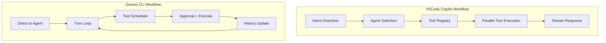

| 측면 | VSCode Copilot | Gemini CLI |
|-----|---------------|-----------|
| **Agent 수** | 8개 특화 Agent | 1개 메인 + 서브 Agent |
| **Intent Detection** | 명시적 (패턴 기반) | 암시적 (LLM 판단) |
| **도구 실행** | 병렬 실행 | 순차 실행 (Turn-based) |
| **종료 조건** | Intent 완료 | complete_task 호출 필요 |
| **사용자 제어** | 낮음 (자동) | 높음 (승인 모드) |
| **복구 메커니즘** | 제한적 | Grace period + 압축 |

**장점 비교:**

**VSCode Copilot 장점:**
- 명확한 Agent 역할 분리
- 빠른 병렬 도구 실행
- VSCode 긴밀한 통합

**Gemini CLI 장점:**
- 유연한 단일 Agent
- 명시적 사용자 승인
- 더 정교한 복구 메커니즘
- Scratchpad 방식 체계적 탐색

---

## 3. 사용자 Query 처리 흐름

### 3.1 VSCode Copilot Chat 플로우

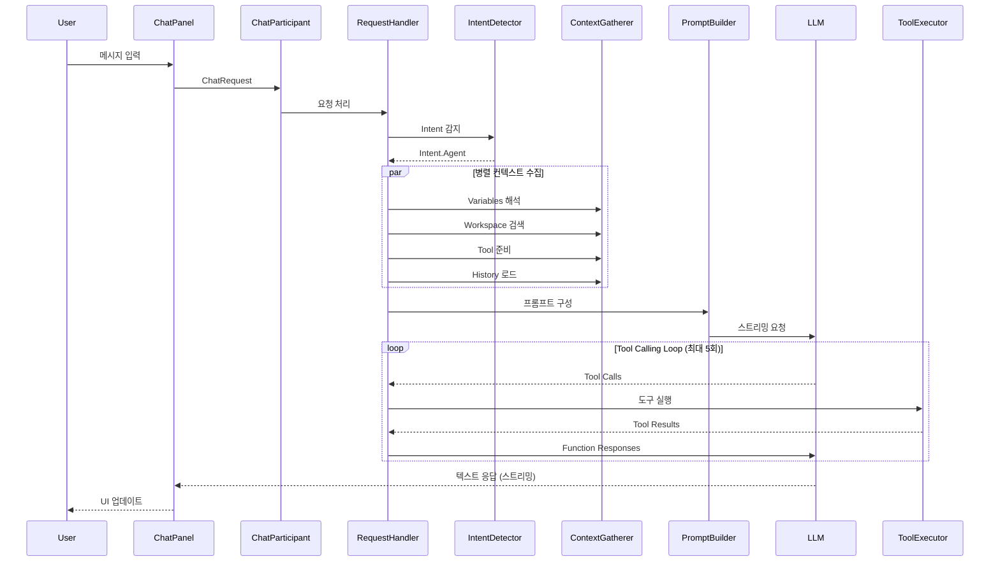

**주요 단계 상세:**

1. **입력 수신**
   - Location: panel, editor, terminal, notebook
   - References: files, symbols, selections
   - Variables: #file, #selection 등

2. **Intent Detection**
   ```
   User Message → Intent Detector
   ↓
   분석:
   - 명령어 존재 (/new, /fix, /tests)
   - Agent 컨텍스트
   - 메시지 패턴
   - 대화 히스토리
   ↓
   Intent 매핑
   ```

3. **컨텍스트 수집 (병렬)**
   - Variables Resolution
   - Workspace Search
   - Tool Preparation
   - History Processing

4. **프롬프트 구성**
   - `@vscode/prompt-tsx` 사용
   - React 스타일 컴포넌트
   - 토큰 예산 제한 적용

5. **모델 요청**
   - Copilot 엔드포인트
   - 스트리밍 모드
   - Tool calling 지원

6. **응답 처리**
   - 텍스트 청크 → UI 스트리밍
   - Tool calls → 실행 및 결과 주입
   - References → 메시지에 추가

---

### 3.2 Gemini CLI 플로우

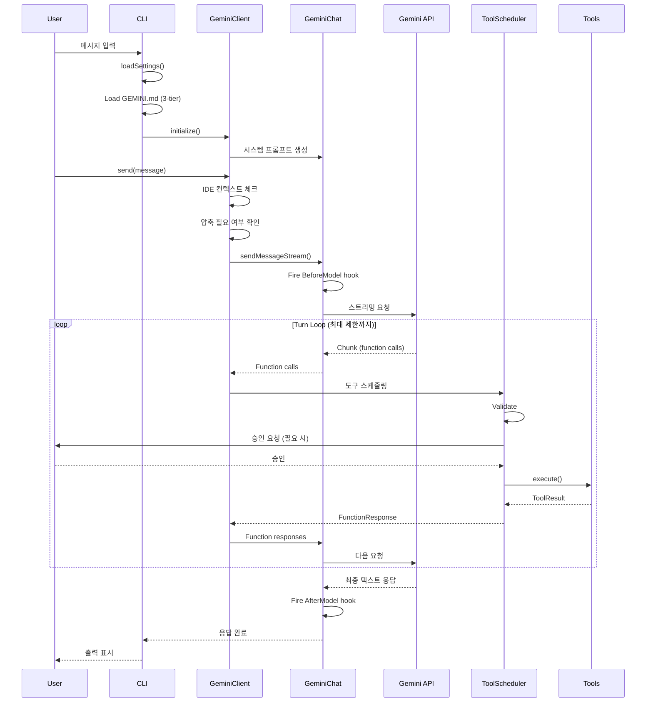

**주요 단계 상세:**

1. **초기화 단계**
   ```
   1. loadSettings() → ~/.gemini/settings.json
   2. parseArguments() → CLI args
   3. loadCliConfig() → Config 생성
   4. initializeApp() → 인증, 확장 로드
   5. Load GEMINI.md (Global, Env, JIT)
   ```

2. **메시지 처리**
   ```
   GeminiClient.send()
   ↓
   - 사용자 메시지 → History에 추가
   - IDE 컨텍스트 변경 체크
   - 압축 필요 시 수행
   - sendMessageStream() 호출
   ```

3. **스트림 처리**
   ```
   For each chunk:
   - Function calls 추출
   - Text parts 추출
   - Thought parts 추출 (내부 추론)
   ```

4. **도구 실행 루프**
   ```
   For each function call:
   1. 도구 존재 확인
   2. 파라미터 파싱
   3. 승인 체크
      - 안전 도구 → 자동 승인
      - 수정 도구 → 사용자 확인
   4. AbortSignal로 실행
   5. 출력 처리 (필요 시 truncate/파일 저장)
   6. FunctionResponse 생성
   7. 대화 History에 추가
   ```

5. **턴 완료**
   ```
   1. 모든 function responses 수집
   2. 루프 감지 체크
   3. 최대 턴 체크
   4. 모델에 다시 전송
   5. 텍스트 응답까지 반복
   ```

---

### 3.3 비교 분석

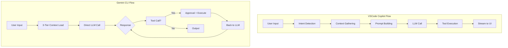

| 측면 | VSCode Copilot | Gemini CLI |
|-----|---------------|-----------|
| **초기화** | VSCode 확장 활성화 | CLI 시작 + 3-tier 로드 |
| **컨텍스트 로딩** | 온디맨드 검색 | 사전 로드 (GEMINI.md) |
| **Intent 처리** | 명시적 라우팅 | LLM 자체 판단 |
| **도구 승인** | 자동 (암시적) | 명시적 사용자 승인 |
| **응답 속도** | 빠름 (병렬) | 중간 (순차) |
| **투명성** | 낮음 | 높음 (도구 호출 표시) |
| **취소 가능성** | 제한적 | 높음 (AbortSignal) |

**플로우 복잡도:**

**VSCode Copilot:**
- 더 많은 사전 처리 단계
- Intent detection 오버헤드
- 복잡한 컨텍스트 수집
- 하지만 병렬 처리로 보상

**Gemini CLI:**
- 단순한 선형 플로우
- Turn-based 명확한 단계
- 사용자 제어 지점 많음
- 순차 처리로 인한 지연

---

## 4. 종합 비교 및 장단점

### 4.1 아키텍처 비교 요약

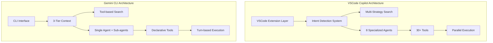

### 4.2 핵심 차이점

| 차원 | VSCode Copilot | Gemini CLI |
|-----|---------------|-----------|
| **플랫폼** | VSCode 통합 | 독립 CLI |
| **검색 방식** | 자동 벡터 인덱싱 | 명시적 문서 + 도구 |
| **Agent 모델** | 다중 특화 Agent | 단일 범용 Agent |
| **실행 모델** | 병렬 + 스트리밍 | 순차 Turn-based |
| **사용자 제어** | 낮음 (자동화) | 높음 (승인 시스템) |
| **투명성** | 낮음 | 높음 |
| **설정 복잡도** | 매우 낮음 | 중간 |
| **확장성** | VSCode API 의존 | MCP 프로토콜 지원 |

### 4.3 장단점 분석

#### VSCode Copilot Chat

**장점:**

1. **사용자 경험**
   - 즉시 사용 가능 (설정 최소화)
   - VSCode와 긴밀한 통합
   - 빠른 응답 속도 (병렬 처리)
   - 풍부한 UI (패널, 인라인, 터미널)

2. **기술적 우수성**
   - 정교한 하이브리드 검색
   - 자동 임베딩 인덱싱
   - GitHub 원격 검색 통합
   - 30+ 도구의 광범위한 기능

3. **확장성**
   - 모듈러 아키텍처
   - 도구 가상화로 토큰 효율성
   - 다양한 LLM 엔드포인트 지원

**단점:**

1. **제어성**
   - 낮은 사용자 제어
   - 블랙박스 의사결정
   - 도구 호출 투명성 부족

2. **종속성**
   - VSCode 전용
   - GitHub Copilot 구독 필요
   - 제한된 커스터마이징

3. **리소스**
   - 높은 메모리 사용 (인덱스)
   - 초기 인덱싱 시간
   - 대규모 워크스페이스 부담

---

#### Gemini CLI

**장점:**

1. **투명성 및 제어**
   - 명시적 도구 승인
   - 명확한 턴 기반 실행
   - 사용자 정의 GEMINI.md
   - AbortSignal 취소 지원

2. **유연성**
   - 플랫폼 독립적 (CLI)
   - MCP 프로토콜 확장
   - 커스텀 도구 추가 용이
   - IDE 통합 가능 (옵션)

3. **효율성**
   - 낮은 메모리 풋프린트
   - 온디맨드 컨텍스트 로딩
   - 명시적 도메인 지식 주입

4. **체계성**
   - Scratchpad 탐색 방법론
   - 복구 메커니즘
   - 채팅 압축 자동화

**단점:**

1. **사용자 경험**
   - 초기 설정 필요 (GEMINI.md)
   - CLI 인터페이스 제약
   - 더 긴 응답 시간 (순차)

2. **기능성**
   - 더 적은 기본 도구
   - IDE 통합 제한적
   - 덜 정교한 검색

3. **학습 곡선**
   - GEMINI.md 작성법 학습
   - 도구 승인 흐름 이해
   - Agent 동작 방식 파악

---

### 4.4 사용 시나리오별 추천

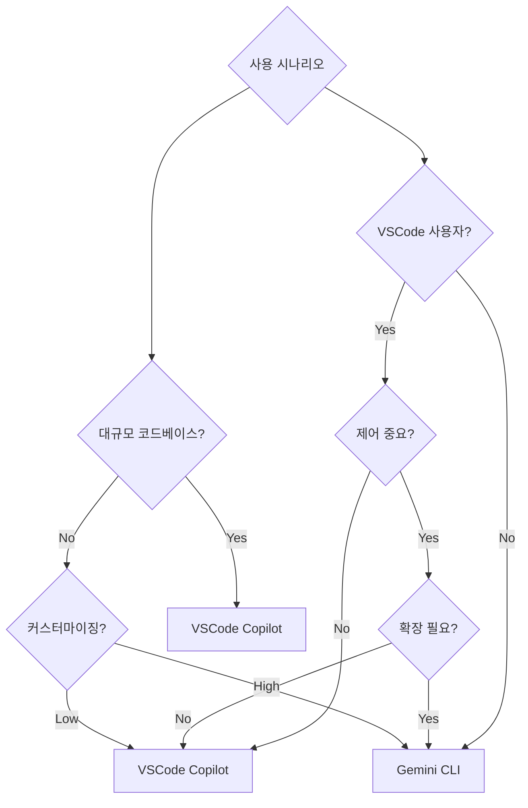

**VSCode Copilot 추천 시나리오:**

1. VSCode 주 IDE 사용자
2. 빠른 프로토타이핑 및 개발
3. 대규모 코드베이스
4. 최소 설정 선호
5. GitHub 생태계 사용자

**Gemini CLI 추천 시나리오:**

1. 다양한 IDE/에디터 사용
2. 높은 투명성 요구
3. 커스텀 워크플로우 필요
4. 도메인 특화 지식 주입
5. 보안/승인 중요 환경
6. 스크립팅 자동화

---

### 4.5 미래 발전 방향

**VSCode Copilot 개선 영역:**

1. 도구 호출 투명성 향상
2. 사용자 커스터마이징 옵션 확대
3. 로컬 모델 지원
4. 더 세밀한 제어 옵션

**Gemini CLI 개선 영역:**

1. GUI 옵션 제공
2. 자동 인덱싱 선택 기능
3. 병렬 도구 실행 지원
4. 더 많은 기본 도구

---

## 5. 결론

두 시스템은 서로 다른 철학을 가진 우수한 AI 코드 Agent입니다:

**VSCode Copilot**은 **"자동화와 통합"**에 초점:
- IDE 네이티브 경험
- 최소 설정으로 최대 생산성
- 정교한 기술 스택

**Gemini CLI**는 **"투명성과 제어"**에 초점:
- 플랫폼 독립성
- 사용자 명시적 제어
- 유연한 커스터마이징

최적의 선택은 사용자의 **작업 환경, 제어 선호도, 커스터마이징 필요성**에 따라 달라집니다.

---

## 부록: 주요 파일 참조

### VSCode Copilot Chat

| 기능 | 파일 경로 |
|-----|---------|
| 코드베이스 검색 | `src/extension/tools/node/codebaseTool.tsx` |
| 워크스페이스 검색 | `src/platform/workspaceChunkSearch/node/workspaceChunkSearchService.ts` |
| 임베딩 인덱스 | `src/platform/embeddings/embeddingsIndex.ts` |
| Agent 등록 | `src/extension/conversation/vscode-node/chatParticipants.ts` |
| 요청 핸들러 | `src/extension/prompt/node/chatParticipantRequestHandler.ts` |
| 도구 레지스트리 | `src/extension/tools/common/toolsRegistry.ts` |

### Gemini CLI

| 기능 | 파일 경로 |
|-----|---------|
| CLI 진입점 | `packages/cli/index.ts` |
| 메인 로직 | `packages/cli/src/gemini.tsx` |
| GeminiClient | `packages/core/src/core/client.ts` |
| GeminiChat | `packages/core/src/core/geminiChat.ts` |
| Agent Executor | `packages/core/src/agents/executor.ts` |
| Tool Scheduler | `packages/core/src/core/coreToolScheduler.ts` |
| Memory Discovery | `packages/core/src/utils/memoryDiscovery.ts` |
| Context Manager | `packages/core/src/services/contextManager.ts` |
| Codebase Investigator | `packages/core/src/agents/codebase-investigator.ts` |

---

**보고서 작성일**: 2025-12-05
**분석자**: Claude Code (Anthropic)
