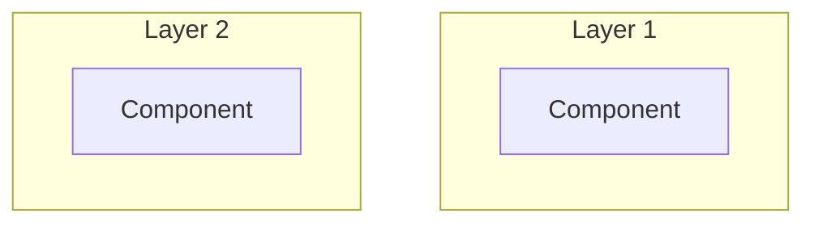
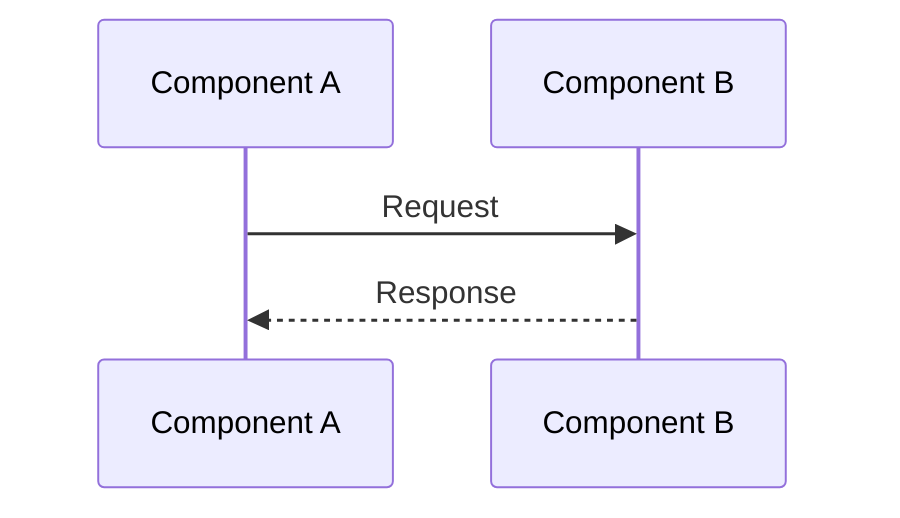

# {시스템명} 아키텍처 분석

**분석일**: YYYY-MM-DD
**대상 버전**:
**GitHub**:

---

## 목차

1. [개요](#1-개요)
2. [시스템 아키텍처](#2-시스템-아키텍처)
3. [핵심 모듈 분석](#3-핵심-모듈-분석)
4. [데이터 흐름](#4-데이터-흐름)
5. [기술 스택](#5-기술-스택)
6. [확장 포인트](#6-확장-포인트)
7. [결론](#7-결론)

---

## 1. 개요

### 1.1 시스템 소개

### 1.2 분석 범위

---

## 2. 시스템 아키텍처



---

## 3. 핵심 모듈 분석

### 3.1 {모듈명}

**위치**: `path/to/module`

**역할**:

**주요 클래스/함수**:

| 이름 | 역할 |
|-----|------|
| | |

**코드 분석**:

```typescript
// 핵심 코드 예시
```

---

## 4. 데이터 흐름



---

## 5. 기술 스택

| 분류 | 기술 | 버전 | 용도 |
|-----|------|-----|------|
| | | | |

---

## 6. 확장 포인트

### 6.1 플러그인/확장 시스템

### 6.2 커스터마이징 가능 영역

---

## 7. 결론

### 장점

### 단점

### 참고할 패턴

---

## 참고 자료

-
