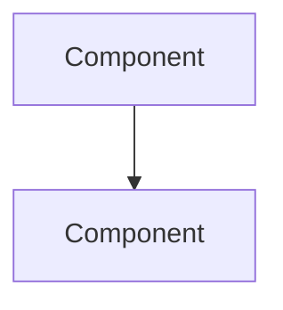

# {Tool A} vs {Tool B} 비교 분석 리포트

## 분석 대상

### {Tool A}
- **타입**:
- **GitHub**:
- **분석 시점 Commit**:
- **Commit 일자**:

### {Tool B}
- **타입**:
- **GitHub**:
- **분석 시점 Commit**:
- **Commit 일자**:

**분석 일자**: YYYY-MM-DD

---

## 목차

1. [개요](#1-개요)
2. [아키텍처 비교](#2-아키텍처-비교)
3. [핵심 기능 비교](#3-핵심-기능-비교)
4. [성능 및 확장성](#4-성능-및-확장성)
5. [장단점 분석](#5-장단점-분석)
6. [결론 및 권장사항](#6-결론-및-권장사항)

---

## 1. 개요

{분석 배경 및 목적}

---

## 2. 아키텍처 비교

### 2.1 {Tool A} 아키텍처

### 2.2 {Tool B} 아키텍처

---

## 3. 핵심 기능 비교

| 기능 | {Tool A} | {Tool B} |
|-----|----------|----------|
| 기능1 | | |
| 기능2 | | |

---

## 4. 성능 및 확장성

---

## 5. 장단점 분석

### {Tool A}
**장점:**
-

**단점:**
-

### {Tool B}
**장점:**
-

**단점:**
-

---

## 6. 결론 및 권장사항

---

## 참고 자료

-
