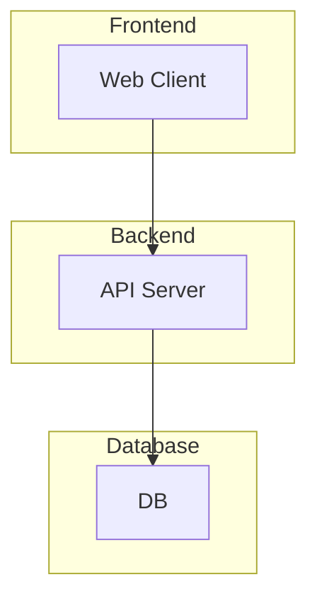

# {프로젝트명} - POC 분석 및 설계 보고서

**작성일**: YYYY-MM-DD
**분석 대상 프로젝트**:
- {프로젝트1}
- {프로젝트2}

---

## 목차

1. [프로젝트 목표 및 요구사항](#1-프로젝트-목표-및-요구사항)
2. [기술 스택 분석](#2-기술-스택-분석)
3. [시스템 아키텍처 설계](#3-시스템-아키텍처-설계)
4. [핵심 컴포넌트 분석](#4-핵심-컴포넌트-분석)
5. [구현 로드맵](#5-구현-로드맵)
6. [리스크 및 해결방안](#6-리스크-및-해결방안)
7. [결론](#7-결론)

---

## 1. 프로젝트 목표 및 요구사항

### 1.1 서비스 개요

**목표**:

### 1.2 핵심 요구사항

- [ ] 요구사항 1
- [ ] 요구사항 2

---

## 2. 기술 스택 분석

| 영역 | 기술 | 선정 이유 |
|-----|------|----------|
| Frontend | | |
| Backend | | |
| Database | | |
| Infra | | |

---

## 3. 시스템 아키텍처 설계



---

## 4. 핵심 컴포넌트 분석

### 4.1 {컴포넌트명}

**역할:**

**주요 코드:**

```typescript
// 코드 예시
```

---

## 5. 구현 로드맵

### Phase 1: 기반 구축
- [ ] 작업 1
- [ ] 작업 2

### Phase 2: 핵심 기능
- [ ] 작업 3
- [ ] 작업 4

---

## 6. 리스크 및 해결방안

| 리스크 | 영향도 | 해결방안 |
|-------|-------|---------|
| | High/Medium/Low | |

---

## 7. 결론

---

## 부록

### A. 참고 자료
-

### B. 용어 정의
-
